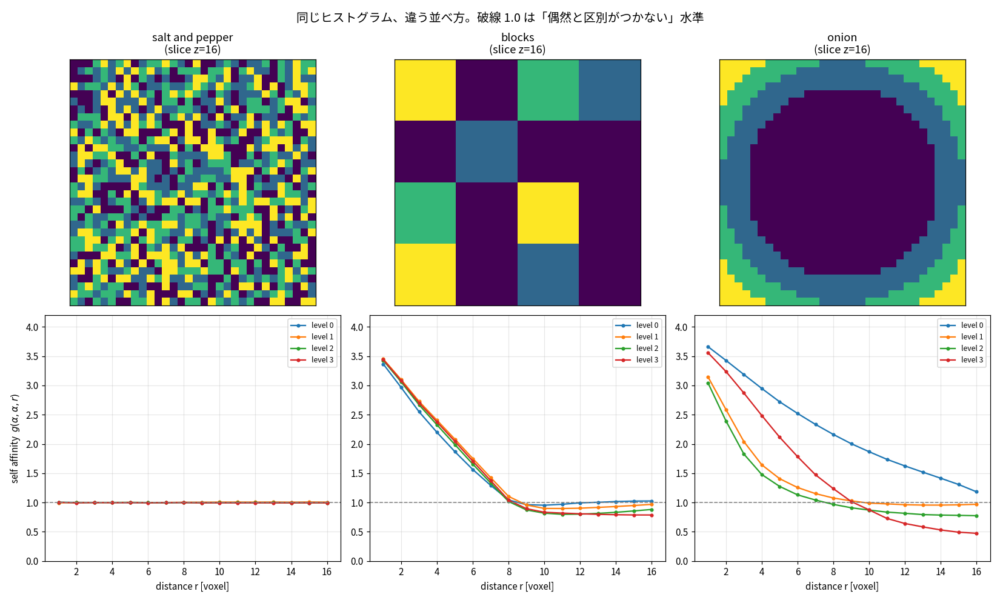
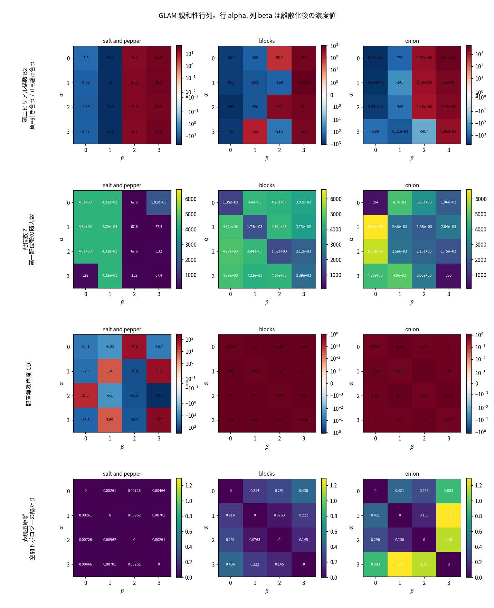
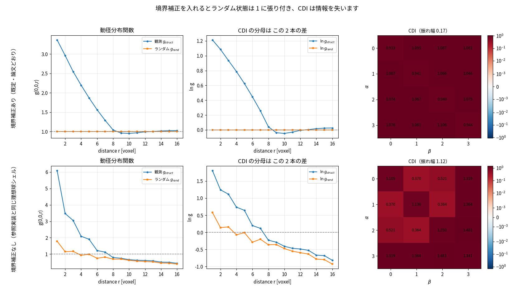
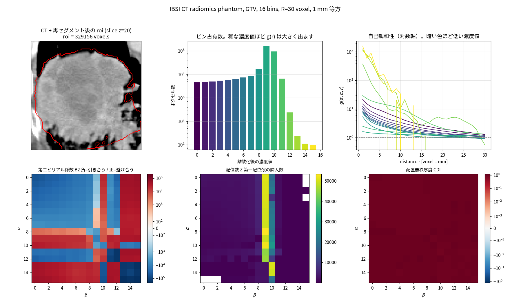

# ヒストグラムが同じでも中身は違う ― RadiomicsJ に GLAM を実装した

> RadiomicsJ 2.3.0 で追加した GLAM（Gray Level Affinity Metrics）特徴ファミリーの
> 解説と、そのまま動かせる計算例です。
>
> 原著: *Physics-Informed Multiscale Decoding of Tissue Microstructure:
> The Gray Level Affinity Metrics (GLAM) Framework*,
> Journal of Imaging Informatics in Medicine (2026),
> [doi:10.1007/s10278-026-02132-6](https://doi.org/10.1007/s10278-026-02132-6)

---

## 1. なぜもう一つテクスチャ特徴が要るのか

放射線画像から取り出す特徴量には、大きく分けて

- **一次統計**（平均・分散・エントロピーなど）… 濃度値の「割合」だけを見る
- **二次統計**（GLCM・GLRLM・GLSZM …）… 濃度値の「並び方」を見る

があります。ところが二次統計の多くは、**ごく近い距離しか見ていません**。
GLCM は既定では 1 ボクセル隣、GLRLM は連続する同一濃度の長さ、GLSZM は
連結した塊の大きさです。

腫瘍の中で起きていることは、しばしばもっと広いスケールの話です。
壊死のコアが中心にあるのか、周縁に散っているのか。血管新生の帯が
どのくらいの厚みで腫瘍を取り巻いているのか。こうした
**数ボクセル〜数十ボクセルの構造**は、1 ボクセル隣を数えるだけでは
うまく数字になりません。

GLAM は、この隙間を「統計力学の道具」で埋めます。

---

## 2. GLAM の考え方 ― ボクセルを相互作用する粒子とみなす

液体や気体の構造を調べるとき、物理では **動径分布関数（radial
distribution function, RDF）** を使います。ある粒子から距離 *r* だけ
離れたところに別の粒子が見つかる確率が、まったくの偶然に比べて何倍か、
というものです。

GLAM はこれを画像に持ち込みます。離散化した濃度値を「粒子の種類」と
みなして

```
g(α, β, r) = 濃度値 α のボクセルから距離 r に濃度値 β が見つかる確率
             ─────────────────────────────────────────────
             まったくランダムに配置したときの同じ確率
```

を計算します。読み方は単純です。

| g の値 | 意味 |
|---|---|
| **> 1** | その距離で 2 つの濃度値は**集まっている**（引き合う） |
| **= 1** | 偶然と区別がつかない |
| **< 1** | その距離で 2 つの濃度値は**避け合っている**（反発する） |

GLCM が「1 ボクセル隣の共起行列」なら、GLAM は
**「あらゆる距離の共起を一度に見る曲線」**です。

そして、この曲線をそのまま機械学習に流すと次元が爆発するので、
曲線を 1 つの数値に凝縮した **19 種類の nBins × nBins 行列** を作ります。
第二ビリアル係数、平均力ポテンシャル、等温圧縮率、配位数、相関長、
構造圧力指数、配置無秩序度、輸送距離……と、名前はどれも物理から
借りたものです。各行列を統計量（平均・分散・歪度・尖度・最小・最大・
対角平均・非対角平均）で要約して、合計 **150 個の特徴量** になります。

---

## 3. 百聞は一見に如かず ― ヒストグラムが完全に同じ 3 つのファントム

言葉で説明するより、動かした方が早いです。

**32×32×32 ボクセル、4 段階の濃度値、各濃度値ちょうど 8192 ボクセル**という
条件を完全に揃えた 3 つのデジタルファントムを作ります。
ヒストグラムが同一なので、**一次統計はすべて完全に一致します**。
違うのは「並べ方」だけです。

| ファントム | 並べ方 |
|---|---|
| **salt and pepper** | 濃度値をボクセル単位でランダムにばらまく |
| **blocks** | 同じ濃度値を 8 ボクセル角のブロックにまとめる |
| **onion** | 同じ濃度値を中心からの距離順に並べ、同心球にする |

### 3.1 実行する

```bash
git clone https://github.com/tatsunidas/RadiomicsJ.git
cd RadiomicsJ
mvn test-compile exec:java -Dexec.mainClass=radiomics.GLAMExample -Dexec.classpathScope=test
```

（ソースは `src/test/java/radiomics/GLAMExample.java` です。）



### 3.2 結果 ― まず一次統計とヒストグラム

```
Intensity histogram, identical by construction
                       level 0     level 1     level 2     level 3
salt and pepper           8192        8192        8192        8192
blocks                    8192        8192        8192        8192
onion                     8192        8192        8192        8192
```

想定どおり、区別がつきません。

### 3.3 GLCM は何を見ているか

```
GLCM, one voxel apart
                      JointEntropy        Contrast     Correlation
salt and pepper             3.9999          2.4999         -0.0001
blocks                      2.7947          0.4314          0.8270
onion                       2.7271          0.1651          0.9322
```

GLCM は **salt and pepper をきれいに切り分けます**。ばらまいた配置は
隣のボクセルが無相関なので、Correlation がほぼ 0、JointEntropy が最大の
4.0（= log2 16）になります。ここは期待どおりです。

一方で **blocks と onion の区別は苦手**です。
JointEntropy は 2.79 対 2.73 でほとんど差がありません。
どちらも「隣は自分と同じ濃度値であることが多い」局所的に滑らかな画像なので、
1 ボクセル隣だけを見ている限り、両者は似て見えます。

けれども 2 つの構造はまったく別物です。片方は 8 ボクセルで途切れる塊、
もう片方は画像全体を貫く同心球構造です。

### 3.4 GLAM は距離のスケールをそのまま見せる

濃度値 0 が自分自身とどれくらい集まっているか、g(0,0,r) を距離ごとに並べます。

```
Self affinity of gray level 0, g(0,0,r)
r =                      1       2       3       4       5       6       7       8       9      10      11      12
salt and pepper      0.998   1.005   1.000   1.001   1.003   1.004   1.005   1.004   1.006   1.007   1.007   1.007
blocks               3.459   3.111   2.743   2.423   2.112   1.807   1.516   1.236   1.104   1.042   1.011   0.987
onion                3.661   3.427   3.186   2.948   2.720   2.522   2.334   2.163   2.004   1.867   1.737   1.624
```

一目瞭然だと思います。

- **salt and pepper** はどの距離でも `1.000` 付近。
  「偶然と区別がつかない」という定義どおりの値が出ています。
  これは同時に、実装が正しく正規化できていることの確認にもなります。
- **blocks** は近距離で 3.46 と強く集まりますが、
  **r ≈ 11 でちょうど 1.0 に戻ります**。ブロックの一辺が 8 ボクセルなので、
  相関が切れる距離がそのまま数字に出ています。
- **onion** は r = 12 でもまだ 1.62。同心球なので相関が遠くまで続きます。

**GLCM ではほとんど同じに見えた 2 つが、構造の長さスケールごと分離できました。**
これが GLAM の売りです。

### 3.5 行列を読む ― 第二ビリアル係数

曲線を 1 つの数値に凝縮したものが第二ビリアル係数 B₂ です。
負なら正味の引力（集まる）、正なら正味の斥力（避け合う）を意味します。

```
Second virial coefficient of every gray level with itself, B2(a,a)
                         level 0       level 1       level 2       level 3
salt and pepper            -58.7          10.5          22.2          21.2
blocks                    -690.6         -38.8         -43.9       -1014.4
onion                    -5706.7        -144.9        1182.7        1848.4
```

onion の行が面白いところです。

- **level 0 は −5706.7**。同心球の一番内側、つまり中心の
  コンパクトなコアです。自分自身と極めて強く引き合っています。
- **level 3 は +1848.4**。一番外側の薄い殻です。
  同じ濃度値なのに、球の反対側にある自分自身とは遠く離れているので、
  正味では**斥力側**に出ます。

つまり B₂ の対角成分は「その濃度値が塊なのか殻なのか」を
そのまま語っています。

> **実装上の注意**：この構造があるので、`SecondVirialCoefficient_DiagonalMean`
> のように対角を平均してしまうと −5706.7 と +1848.4 が打ち消し合い、
> せっかくの情報が消えます。濃度値ごとに読むか、`_Minimum` / `_Maximum`
> を使ってください。GLAM の 150 特徴には両方が含まれています。

主要な親和性行列をヒートマップにすると、3 つのファントムの差がそのまま見えます。



**表現型距離**（一番下の行）が分かりやすい例です。salt and pepper では
すべての濃度値が空間的に同じ構造（＝完全にランダム）なので、行列は
ほぼ 0 で埋まります。blocks では 0.07〜0.44、onion では最大 1.3 まで
広がります。対角が 0 で完全対称になっているのは、これが真の距離
（メトリック）であることの確認にもなります。

### 3.6 CDI（配置無秩序度）には注意が要る

ここで 1 つ、実装して図にしてみて初めて分かったことがあります。

配置無秩序度 CDI は

```
CDI(r) = ln g_struct(r) / ( ln g_struct(r) − ln g_rand(r) )
```

と定義されます。つまり「観測した秩序」を「観測とランダムの隔たり」で
割った量です。ところが**境界補正を入れるとランダム状態はきっちり 1 に
正規化される**ので、`ln g_rand ≈ 0` となり、分母が分子とほぼ同じになって
**CDI は 1 に張り付きます**。



blocks ファントムで行列の振れ幅を測ると

| | 振れ幅 |
|---|---|
| 境界補正あり（既定） | **0.17** |
| 境界補正なし | **1.12** |

と 6 倍以上違います。境界補正なしの方では、対角（自己ペア 1.1〜1.3）と
一部の非対角（0.36〜0.52）がはっきり分かれていて、情報が残っています。

逆に、**本当にランダムな配置**（salt and pepper）では分子・分母とも
0 に近づくため、CDI は ±数百まで暴れます。

要するに CDI の変動は、組織の無秩序さというより **ROI の形**から来ています。
CDI と、それで割る FrustrationIndex を使いたい場合は
`BOOL_GLAM_boundaryCorrection=0` にしてください。
他の 17 行列は境界補正の影響を受けません。

---

## 4. 使い方

### 4.1 Java から

```java
import ij.ImagePlus;
import io.github.tatsunidas.radiomics.features.GLAMFeatures;
import io.github.tatsunidas.radiomics.features.GLAMFeatureType;
import io.github.tatsunidas.radiomics.features.GLAMMatrixType;

ImagePlus image = /* 等方ボクセルにリサンプリング済みの画像 */;
ImagePlus mask  = /* 同じ形状の ROI マスク */;

GLAMFeatures glam = new GLAMFeatures(
        image, mask,
        1,        // マスクのラベル
        true,     // 固定ビン数で離散化
        32,       // ビン数
        null,     // ビン幅（固定ビン幅を使うときに指定）
        50);      // 動径分布を評価する最大距離（ボクセル）

// 150 個すべて
for (GLAMFeatureType type : GLAMFeatureType.values()) {
    System.out.println(type.name() + " = " + glam.calculate(type.id()));
}

// 行列そのものを取り出す（可視化や解釈に）
double[][] virial = glam.getMatrix(GLAMMatrixType.SecondVirialCoefficient);

// 動径分布関数そのもの。g[r][alpha][beta]、r は 1 から
double[][][] g = glam.getRadialDistributionFunction();
```

### 4.2 Python（PyPI 版ラッパー）から

```bash
pip install radiomicsj
```

```python
import numpy as np
import radiomicsj

image = ...   # (Z, Y, X) の numpy 配列
mask  = ...   # 同じ形状の ROI マスク

glam = radiomicsj.GLAM(image, mask, spacing=(1.0, 1.0, 1.0),
                       n_bins=32, max_radius=50)

features = glam.get_all_features()          # 150 個の dict
virial   = glam.get_matrix(radiomicsj.GLAM.SecondVirialCoefficient)
rdf      = glam.get_rdf()                   # g[r, alpha, beta]

# 濃度値 0 の自己親和性曲線
import matplotlib.pyplot as plt
plt.plot(range(1, glam.max_radius + 1), rdf[1:, 0, 0])
plt.axhline(1.0, ls="--", c="gray")         # 偶然のライン
plt.xlabel("distance r [voxel]")
plt.ylabel("g(0, 0, r)")
plt.show()
```

### 4.3 設定ファイルから（バッチ抽出）

`settings_3D_example.properties` に GLAM の項目を追加してあります。

```properties
! 特徴ファミリーとして ON/OFF する
BOOL_enableGLAM=1

! 動径分布を評価する最大距離（ボクセル）
INT_GLAM_maxRadius=100
! 各距離シェルを ROI 内に残る割合で正規化する（論文どおり）
BOOL_GLAM_boundaryCorrection=1
! 濃度値ごとの中心ボクセル数。0 は ROI 全体（厳密）
INT_GLAM_maxReferenceVoxels=0
! ランダム状態のシャッフル回数。0 は厳密な閉形式
INT_GLAM_numRandomisations=0
```

GLAM は既定で **OFF** です。IBSI の標準特徴ではないこと、そして
ROI のボクセル対をすべて走査するため他のファミリーより計算コストが
高いことが理由です。

---

## 5. 実装するうえで判断したこと

原著の実装（[glam-radiomics](https://github.com/yurivelichko/glam-radiomics)）を
読み込みながら Java に移植しました。そのまま写すのではなく、
検証した結果として変えた点が 3 つあります。すべて設定で元に戻せます。

### 5.1 ランダム状態は「厳密な閉じた式」で置き換えた

GLAM の多くの指標は、実際の配置を「濃度値を ROI 内でシャッフルした
ランダム配置」と比較します。原著の実装は実際に 4 回シャッフルして
平均を取ります。

しかしこのランダム状態には**閉じた式**があります。
シャッフルは空間相関を完全に壊すので、残るのは ROI の幾何学と
「ボクセルは自分自身の隣人にならない」という事実だけです。
ROI 内のボクセル数を N、濃度値 α のボクセル数を N(α)、
距離 r のシェルのうち ROI 内に残る割合を φ(r) と書くと

```
g_random(α, β, r) = φ(r) · N / (N − 1)                          （α ≠ β）
g_random(α, α, r) = φ(r) · N · (N(α) − 1) / (N(α) · (N − 1))
```

となります。

これが本当にモンテカルロ平均の極限であることは、実測で確かめました。
シャッフル回数を 10 → 40 → 160 → 640 と増やすと、
閉じた式との二乗平均偏差は 0.0165 → 0.0048 → 0.0059 → 0.0018 と
**ちょうど 1/√N で減衰**します。系統的なズレはありません。

つまり原著が 4 回のシャッフルで得ている値には、
消えないサンプリング雑音が乗っています。
（原著のドキュメント自身、JS ダイバージェンス特徴を
「shot noise しか測っていなかった」として削除した経緯を書いています。）

RadiomicsJ は既定で閉じた式を使います。**厳密・再現可能・追加コストゼロ**です。
原著と同じ挙動が必要なら `INT_GLAM_numRandomisations=4` にしてください。

### 5.2 境界補正を既定で ON にした

論文本文は「ROI の縁の影響を打ち消すために幾何学的利用可能率 φ(r) で
正規化する」と明記しています。ところが公開実装のパイプラインは、
この補正を渡さずに理想球シェルで正規化しています。

補正なしだと g(r) は ROI の形そのものに引きずられ、
ROI が大きいか小さいかで値が動いてしまいます。
RadiomicsJ は**論文の記述どおり**、境界補正を既定 ON にしました。
公開実装と数値を突き合わせたいときは
`BOOL_GLAM_boundaryCorrection=0` にしてください。両方の挙動を検証済みです。

### 5.3 相関長のフィッティングを収束させた

相関長は `A·exp(−κr)` の非線形最小二乗フィットで求めます。
原著は `curve_fit(..., ftol=1e-3)` と、かなり緩い停止条件を使っています。

同じデータを厳しい停止条件で再フィットしたところ、
**76 ケース中 73 ケースで残差が真に小さくなりました**。
つまり原著の値は最小値に到達する前に止まっています。
RadiomicsJ は収束させた値を返します。

---

## 6. 検証

「論文のアルゴリズムどおりに実装できているか」を、
原著の Python 実装を正解として突き合わせました。

4 つのデジタルファントム（checkerboard / layered sphere / random field /
clustered blobs）× 正規化 2 モード（理想球シェル / 境界補正）について、

1. 動径分布関数 g(α, β, r) そのもの
2. そこから導かれる 19 種類すべての親和性行列

を要素ごとに比較しています。

| 対象 | 結果 |
|---|---|
| 動径分布関数 | **一致**（相対誤差 < 1e-9） |
| 19 行列のうち 18 種 | **一致**（相対誤差 < 1e-9） |
| InverseCorrelationLength | 一致（相対誤差 < 1e-4、5.3 の理由） |

参照値の生成スクリプトは原著の関数をそのまま呼んでいます。
テストは `src/test/java/radiomics/TestGLAMFeatures.java`、
参照値は `src/test/resources/glam/` にあります。

```bash
mvn -o test
```

---

## 7. 制限と実務上の注意

### 7.1 等方ボクセルにしてから使う

GLAM は距離をボクセル格子の上で測ります。
`DOUBLEARRAY_resamplingFactorXYZ=1.0,1.0,1.0` などで
**等方ボクセルにリサンプリングしてから**使ってください。
非等方のまま渡すと警告が出ます。

### 7.2 3D 専用

GLAM は球殻上の動径分布なので、体積に対してのみ定義されます。
`BOOL_force2D=1` のときや単一スライスのときは、
中途半端な値を出すのではなく**スキップしてログを残します**。

### 7.3 計算コストは ROI ボクセル数の 2 乗

ROI のボクセル対をすべて走査するので O(n²) です。
実測（8 コア、密な ROI）:

| ROI ボクセル数 | 時間 |
|---|---|
| 8,000 | 0.7 秒 |
| 27,000 | 2.2 秒 |
| 64,000 | 7.0 秒 |
| 91,000 | 12.0 秒 |
| 125,000 | 22.4 秒 |

大きな ROI では `INT_GLAM_maxReferenceVoxels` で中心ボクセルを
間引けます。113,000 ボクセルの球状 ROI で 1,000 に間引くと
**約 3 倍速く**なり、第二ビリアル係数のズレは **0.15 %** でした。

### 7.4 CDI と FrustrationIndex は境界補正と相性が悪い

3.6 のとおりです。この 2 つを使うなら `BOOL_GLAM_boundaryCorrection=0` に
してください。他の 17 行列は影響を受けません。

### 7.5 実装したのは統計力学クラスまで

原著の GLAM フレームワークには、これに加えて幾何・トポロジー系
（フラクタル次元、ラクナリティ、ベッチ数、パーコレーション、
グラニュロメトリ、ネマティック秩序）も含まれます。
今回実装したのは**動径分布関数から導かれる統計力学・熱力学クラス
（19 行列 / 150 特徴）**です。
なお RadiomicsJ には以前から `FractalFeatures` と `BettiNumberMap` があるので、
必要ならそちらと組み合わせられます。

---

## 8. 実データで見る

リポジトリに同梱されている IBSI CT radiomics phantom（実 CT + 輪郭）で
同じことをやってみます。1 mm 等方にリサンプリングし、
IBSI の設定 C/D と同じ [-500, 400] HU で再セグメントしたうえで、
16 ビン、R = 30 voxel（= 30 mm）で計算しました。



読みどころは 3 つあります。

1. **自己親和性（右上、対数軸）**。よく埋まっているビンでは r = 1 で 10〜20 倍、
   そこから単調に落ちて **r ≈ 30 mm でほぼ 1.0**、つまり偶然の水準に戻ります。
   「この組織は 3 cm 程度で自己相関を失う」ということが直接読めます。
2. **ビン占有数（中央上）**。上位ビンは数十ボクセルしかありません。
   g(r) は「その濃度値の全体比率」で割る量なので、**稀なビンほど値が跳ねます**
   （右上の黄色いギザギザした線）。これはバグではなく定義どおりの挙動ですが、
   固定ビン数を使うときは占有数を必ず確認してください。
3. **第二ビリアル係数（左下）**。ビン 0〜7（低 HU 側）どうしが引き合い（青）、
   ビン 9 以上（軟部組織側）との間が反発（赤）という、
   はっきりしたブロック構造が出ています。閾値がおよそビン 8〜9 にあり、
   組織の相分離がそのまま行列に写っています。

そして CDI（右下）は、実データでも予告どおり全面が 1 に張り付いています。

図はすべて `docs/make_glam_figures.py` で再現できます。

```bash
cd radiomicsj-python
python3 ../docs/make_glam_figures.py     # docs/images/ に出力
```

## 9. さらに実データへ

公開データで試すのも簡単です。
たとえば TCIA の
[NSCLC-Radiomics](https://www.cancerimagingarchive.net/collection/nsclc-radiomics/)
は CT と GTV セグメンテーションが揃っていて、そのまま使えます。

手順としては

1. CT と RTSTRUCT / SEG を読み込む
2. 1 mm 等方にリサンプリング（`DOUBLEARRAY_resamplingFactorXYZ=1.0,1.0,1.0`）
3. HU で再セグメント（`DOUBLE_rangeMin` / `DOUBLE_rangeMax`）
4. `BOOL_enableGLAM=1` と `INT_GLAM_maxRadius`（腫瘍径に合わせて 30〜50 程度）
5. 抽出

となります。腫瘍が大きいときは `INT_GLAM_maxReferenceVoxels=2000` あたりから
試すと現実的な時間に収まります。

---

## 10. まとめ

- GLAM は**あらゆる距離の共起**を動径分布関数として捉える特徴ファミリー
- ヒストグラムも GLCM もほぼ同じ画像から、**構造の長さスケール**を取り出せる
- RadiomicsJ 2.3.0 から `GLAMFeatures` として利用可能（Java / Python / ImageJ プラグイン）
- 原著実装と要素ごとに突き合わせて検証済み。
  ランダム参照状態は厳密な閉形式に置き換え、境界補正は論文どおり既定 ON、
  相関長のフィットは収束させた
- ただし CDI と FrustrationIndex は境界補正と相性が悪い。
  使うなら `BOOL_GLAM_boundaryCorrection=0`

---

### リンク

- RadiomicsJ: https://github.com/tatsunidas/RadiomicsJ
- 原著論文: https://doi.org/10.1007/s10278-026-02132-6
- 原著実装: https://github.com/yurivelichko/glam-radiomics
- 原著ドキュメント: https://glam-radiomics.readthedocs.io/

---

*本記事のコードは Apache License 2.0 です。
実装にはコーディングアシスタントとして Claude（Anthropic）を利用しました。*
